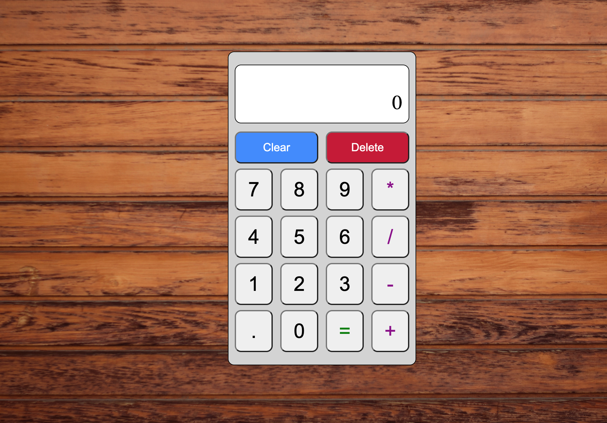

# Calculator
This is an online calculator project assigned in the 'Foundations' curriculum for The Odin Project. The goal for completing this project is to use my front-end skills currently learned and continue to improve and build upon my experience with building fully-functioning client-facing apps.

## Technologies
This project was created with:
* HTML
* CSS
* Javascript

[Live Project on personal website](http://www.joshuaurrea.com/calculator)